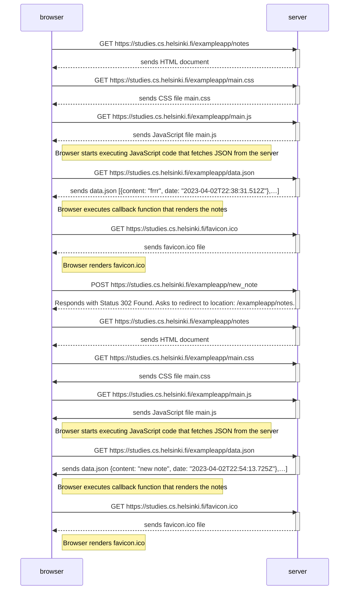

The following is the sequence diagram for
- loading https://studies.cs.helsinki.fi/exampleapp/notes
- creating a new note
- reloading https://studies.cs.helsinki.fi/exampleapp/notes with the new note

