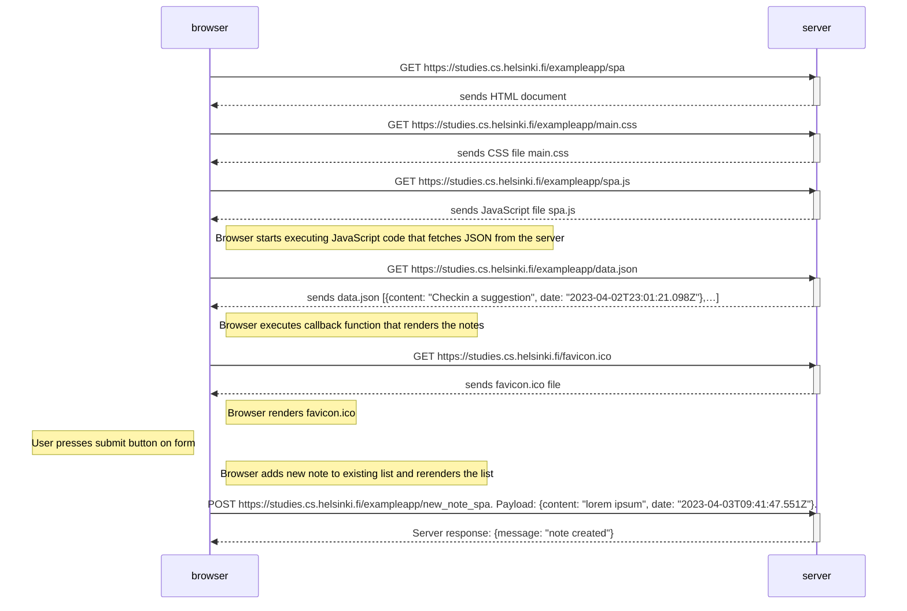

The following is the sequence diagram for
- loading https://studies.cs.helsinki.fi/exampleapp/spa
- creating a new note

```mermaid
sequenceDiagram
	participant browser
	participant server

	browser->>server: GET https://studies.cs.helsinki.fi/exampleapp/spa
	activate server
	server-->>browser: sends HTML document
	deactivate server

	browser->>server: GET https://studies.cs.helsinki.fi/exampleapp/main.css
	activate server
	server-->>browser: sends CSS file main.css
	deactivate server

	browser->>server: GET https://studies.cs.helsinki.fi/exampleapp/spa.js
	activate server
	server-->>browser: sends JavaScript file spa.js
	deactivate server

	Note right of browser: Browser starts executing JavaScript code that fetches JSON from the server
	
	browser->>server: GET https://studies.cs.helsinki.fi/exampleapp/data.json
	activate server
	server-->>browser: sends data.json [{content: "Checkin a suggestion", date: "2023-04-02T23:01:21.098Z"},…]
	deactivate server
	
	Note right of browser: Browser executes callback function that renders the notes

	browser->>server: GET https://studies.cs.helsinki.fi/favicon.ico
	activate server
	server-->>browser: sends favicon.ico file
	deactivate server

	Note right of browser: Browser renders favicon.ico	

	Note left of browser: User presses submit button on form
	
	Note right of browser: Browser adds new note to existing list and rerenders the list
	browser->>server: POST https://studies.cs.helsinki.fi/exampleapp/new_note_spa. Payload: {content: "lorem ipsum", date: "2023-04-03T09:41:47.551Z"}.
	activate server
	server-->>browser: Server response: {message: "note created"}
	deactivate server
```
